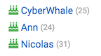

# NodeBB Widget: Birthdays

Efficient widget to output all today's birthdays of community members.

## Table of Contents

<!-- START doctoc generated TOC please keep comment here to allow auto update -->
<!-- DON'T EDIT THIS SECTION, INSTEAD RE-RUN doctoc TO UPDATE -->
 

- [Customization](#customization)
- [Screenshots](#screenshots)
- [How does it work?](#how-does-it-work)
- [Future ideas for improvement](#future-ideas-for-improvement)

<!-- END doctoc generated TOC please keep comment here to allow auto update -->

## Customization

You could change styles for these classes:

- `.birthdays .birthday-item`, responsible for line in the list
- `.birthdays .birthday-name`, responsible for the user's name
- `.birthdays .birthday-age`, responsible for the user's age (Also age could be disabled in widget settings)

If you want change icon style, refer to `.fa` class.

## Screenshots

## How does it work?

1. At start, job will be triggered to check all users that have birthday today. It's an async process. By design it will take some time.
2. Every day at midnight (Server Time), job to find today's birthdays is fired
3. Widget returns birthdays that are stored in memory, It's fast and efficient.

Optimisations:

- to store today's birthdays in memory
- to check for birthdays only once per day
